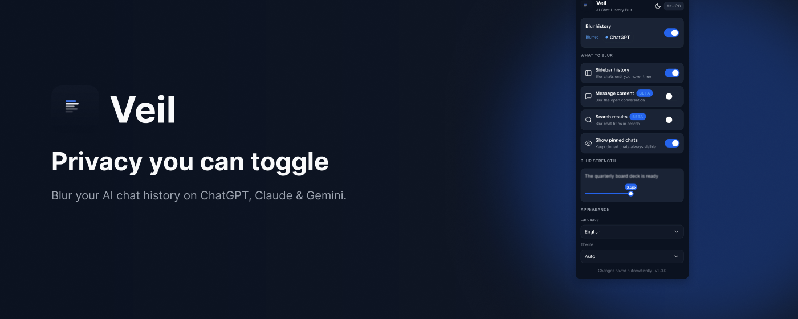
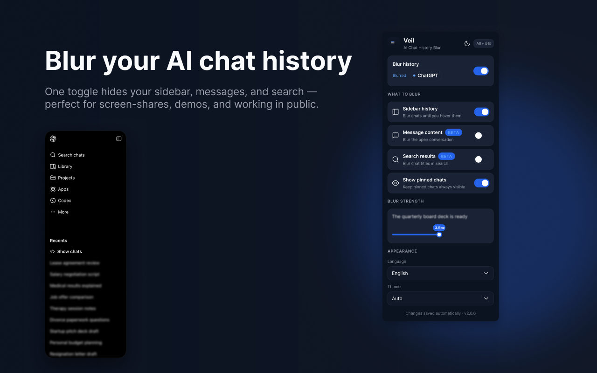
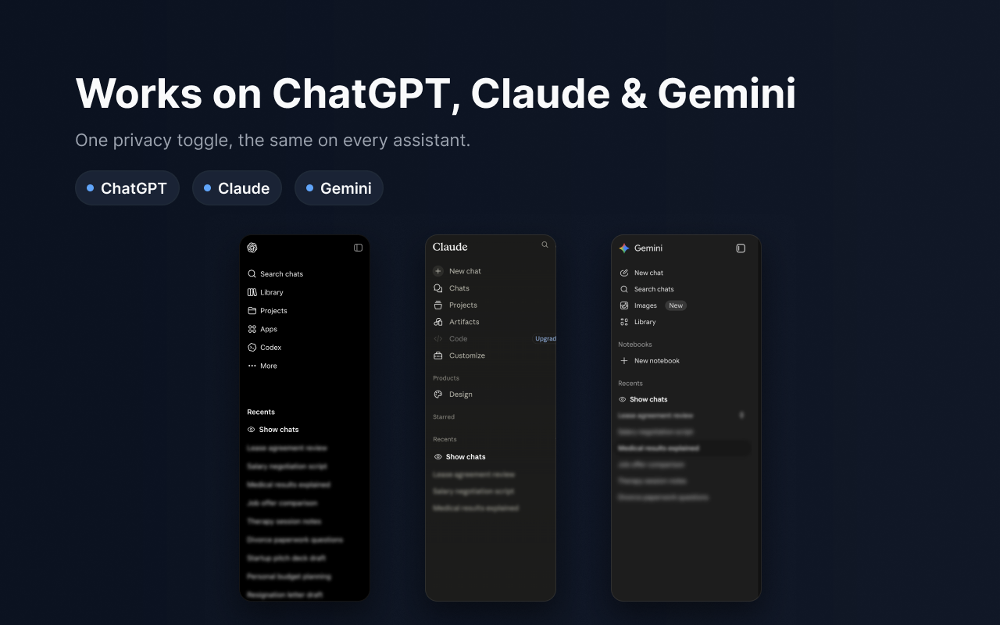
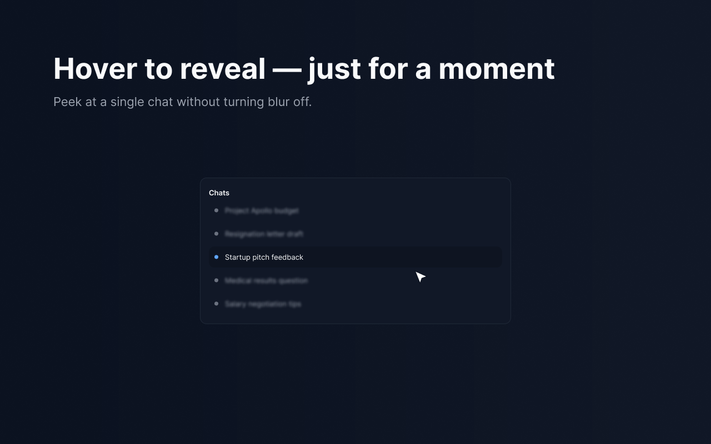
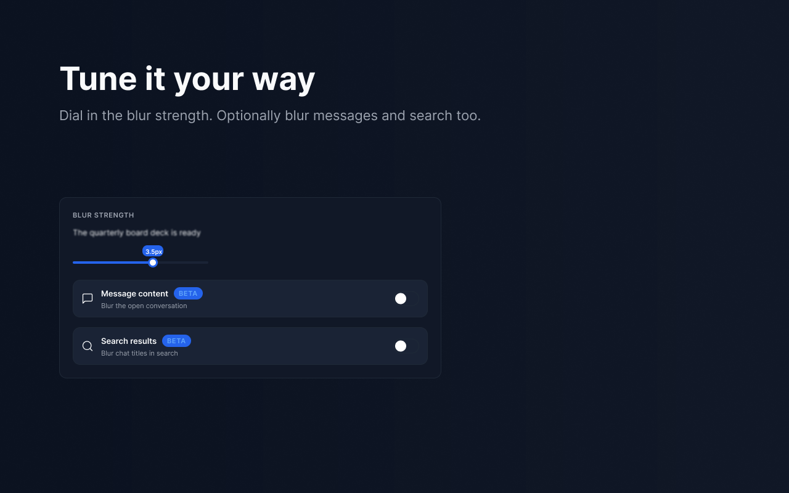
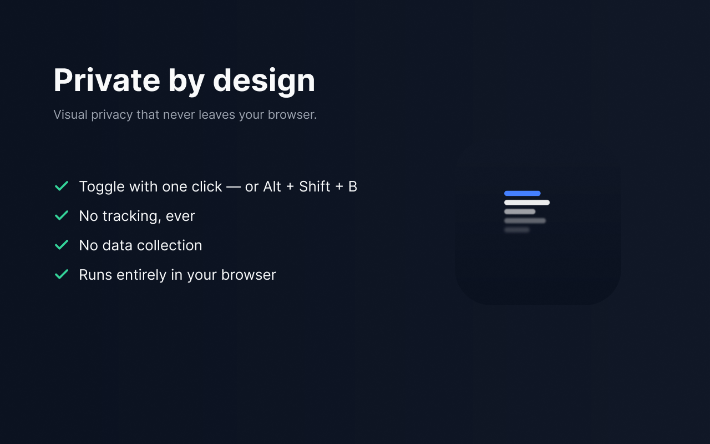

  

<h1 align="center">Veil — AI Chat History Blur</h1>

  Blur your AI chat history on <b>ChatGPT</b>, <b>Claude</b>, and <b>Gemini</b> —
  one‑click privacy for screen sharing, recording, and working in public.

  <a href="https://chromewebstore.google.com/detail/chatgpt-history-blur/gldlgjaiemldondiieoahlblpmfalljo">
    <b>➜ Add Veil to Chrome</b>
  </a>
  &nbsp;·&nbsp;
  <a href="PRIVACY.md">Privacy Policy</a>

---

## What is Veil?

Veil keeps a glance — or a screen share — from exposing a private conversation.
It blurs your sidebar chat titles (and optionally open message content and search
results) on the major AI assistants, and lets you reveal anything for a moment just
by hovering. Toggle it on or off in one click.

It only changes how the page *looks*, locally in your browser. **No accounts, no
tracking, no data collection.**

## Why people use it

- 🖥️ **Screen sharing** in meetings without leaking chat titles
- 🎥 **Recording** tutorials, demos, and courses
- 📽️ **Presenting** on a projector
- ☕ **Working in public** — cafés, offices, planes

## Features

- One‑click blur for your AI chat history sidebar
- Hover any chat to reveal it for a moment, then it re‑blurs
- Adjustable blur strength with a live preview
- Optional blur for open message content and search results
- Keep pinned chats always visible
- Keyboard shortcut to toggle blur instantly
- Light and dark themes · 7 languages
- Lightweight — no account, no setup

## Supported platforms

| Platform | Site |
| --- | --- |
| ChatGPT | chatgpt.com |
| Claude / Anthropic | claude.ai |
| Gemini | gemini.google.com |

More AI platforms over time.

## In action

  
  

  
  

  

## Privacy

Veil collects **no** data. It has no servers and no accounts. Your settings are
stored locally in your browser and never leave your device. Read the full
[Privacy Policy](PRIVACY.md).

## Support

Questions or a bug? [Open an issue](https://github.com/MidnightCoke/veil/issues).

---

© 2026 Veil. Not affiliated with OpenAI, Anthropic, or Google. "ChatGPT", "Claude", and "Gemini" are trademarks of their respective owners and are used only to describe compatibility.

